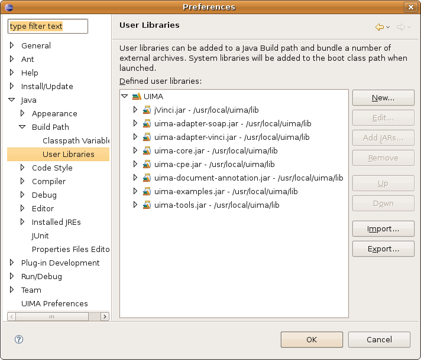

// Define some global attributes
include::_globattr.adoc[]

[[compile_from_source]]
Compile from Source
-------------------
This chapter guides you through installing and compiling the
{osp-short} source code. We assume you're comfortable working from a
command line.

NOTE: If you don't want to or don't know how to compile Java source
files, please read <<binary_install>> instead.

Download sources
~~~~~~~~~~~~~~~~
The source code of the stable release of the {osp-short} can be
downloaded from link:{osp-download}[].

[TIP]
.Check out from Subversion
============
The latest version (not guaranteed stable) can be found on SVN

`svn co https://ohnlp.svn.sourceforge.net/svnroot/ohnlp/trunk/cTAKES cTAKES`
===========

include::_extractpearsrc.adoc[]

TIP: Instead of using the PEAR Installer GUI, you can also unzip all
the PEAR files into a same parent folder, as PEAR files are
self-contained ZIP archives.

///////////////////////////
Binaries no longer included.
NOTE: The included binaries are compiled using Java version
1.5. Therefore, it may not work with other versions of Java.
///////////////////////////

To compile the source code, you need

- link:{jdk-download}[Java JDK] at least version 1.5 (aka JDK 5)
- link:{uima-download}[Apache UIMA], tested on version 2.2.2
- link:{ant-download}[Apache Ant] if not using Eclipse, tested on 1.7.1

Follow these packages' individual instructions to install.

[[compile_in_eclipse]]
Compile in Eclipse
~~~~~~~~~~~~~~~~~~
Make sure you installed the UIMA plugin and EMF plugin into
Eclipse. Consult ``{uima-eclipse}'' in UIMA documentation Book 1
``{uima-doc-book1}'' for details. If you don't use Eclipse, skip this
section and go to <<compile_from_cli>>.

Set up Eclipse workspace
^^^^^^^^^^^^^^^^^^^^^^^^
Open a new Eclipse workspace and create a user library.

. If Eclipse opened an existing workspace, go to File -> Switch
workspace -> Other... and navigate to +{inst-root-dir}+, into which
you extracted all the PEAR packages;
. Go to Window -> Preferences -> Java -> Build Path -> User Libraries;
. Click ``New'';
. Enter UIMA (all capitals) in the ``User library name:'' field;
. Click ``OK'';
. Select the newly created user library, which should enable the button ``Add JARs...'';
. Click ``Add JARs...'';
. Navigate to the +lib+ folder under your UIMA installation directory;
. Select all the files and click ``OK'';
. Now your ``Preference'' dialog should look similar to this;
+
.Create an UIMA user library in Eclipse

+
. Click ``OK'' to close the ``Preference'' dialog.

NOTE: Although creating a new workspace is not required, we recommend
you create one to separate {osp-short} projects from your existing
Eclipse projects.

[[sec_import_and_build]]
Import and build projects
^^^^^^^^^^^^^^^^^^^^^^^^^
Before going to the Eclipse window, extract the files in
+eclipse_specific.tar.gz+ to +{inst-root-dir}+, preserving the
directory structure. 

NOTE: If you are on a Mac, extract to a temporary directory and then 
use +cp -R+, since name collisions are deleted by default.

Then, in the Eclipse window,

. Go to File -> Import...;
. Click the triangle to the left of ``General'' to expand it;
. Select ``Existing Projects into Workspace'' and click ``Next >'';
. Click ``Select root directory:'';
. Either enter +{inst-root-dir}+ in the box or click ``Browse...'' to
navigate to it;
. Make sure you import all the projects by clicking ``Select All'';
. Click ``Finish'' to import.
. If you downloaded the non-PEAR version or checked out source files
from the repository, you need to generate type system from the
following files:
* +chunker/desc/TypeSystem.xml+
* +clinical documents pipeline/desc/analysis_engine/TypeSystem.xml+
* +context dependent tokenizer/src/edu/mayo/bmi/uima/cdt/type/CdtTypeSystem.xml+
* +core/src/edu/mayo/bmi/uima/core/type/TypeSystem.xml+
* +dictionary lookup/src/edu/mayo/bmi/uima/lookup/type/DictionaryLookupTypeSystem.xml+
* +document preprocessor/desc/CDAToTextTypeSystem.xml+
* +NE contexts/desc/TypeSystem.xml+
* +POS tagger/desc/TypeSystem.xml+
* +Drug NER/desc/type_system/NERTypeSystem.xml (optional component)
* +dependency parser/type_system/desc/TypeSystem.xml (optional component)
+
--
To generate type system from Eclipse:

. Open the file in Component Descriptor Editor (right click on the
file -> Open with -> Component Descriptor Editor);
. Click the tab Type System -> run JCasGen (the button in the center) 
--
+
. Click Project -> Build All to build all the projects. If you enabled
``Build automatically'' under the ``Project'' menu, your projects are
already built.

NOTE: Later versions of Eclipse may require you to remove an automatic
version of JUnit and add the JUnit that is included with {osp-short}.
For any package with JUnit compile errors, right click the package name and go to Build Path
-> Libraries -> Configure Build Path -> Libraries to find Eclipse's
JUnit and remove it; then select "Add JARs..." and navigate to
+core/lib/junit.jar+.

Process a sample clinical note
^^^^^^^^^^^^^^^^^^^^^^^^^^^^^^
. Go to Run -> Open Run Dialog...;
. Expand ``Java Application'' in the left pane if it is collapsed;
. Select ``{cvd-eclipse}'';
. Click the ``Run'' button.
. In the CAS Visual Debugger, click Menu -> Run -> Load AE;
. Open +{inst-root-dir}/clinical documents pipeline/desc/analysis_engine/AggregatePlaintextProcessor.xml+;
include::_testrun.adoc[]

[[compile_from_cli]]
Compile from command line
~~~~~~~~~~~~~~~~~~~~~~~~~
If you happen to use Eclipse, you may be interested in
<<compile_in_eclipse>> instead.
Even if you are not using Eclipse's GUI, it is recommended that you have a viable 
Eclipse installation on hand.  This section mostly assumes that case.

Prepare the compiling environment
^^^^^^^^^^^^^^^^^^^^^^^^^^^^^^^^^
We ship an Apache ant build file in the stable release. Before using
it, modify the included `build.properties` file (shown below) in
+{inst-root-dir}+ by supplying your machine's configuration. Although
this file is not required, we recommend you create one, which can ease
debugging efforts, as environmental variables may be changed without
your awareness. It also helps insert {osp-short} version number to the
generated Javadoc files.

-------------------------------------------------------
# Please do not comment or remove the following line.
RELEASE_VERSION=version

# UIMA_HOME is the same as your environment variable
#           when you installed Apache UIMA.
#           No trailing slash/backslash.
#           This is optional, if not set, build.xml
#           will read from your environment variable.
UIMA_HOME=

# ECLIPSE_HOME is where you installed Eclipse IDE.
#              No trailing slash/backslash.
#              This is optional, if not set, build.xml
#              will read from your environment variable.
#              This is only useful if you are going to
#              Eclipse as your IDE after compiling.
ECLIPSE_HOME=
-------------------------------------------------------

[NOTE]
===================================================================
Windows users: Please use escaped backslash (+\\+) in paths, for
example: +C:\\a\\path+, or forward slash (+/+), for example:
+C:/a/path+.

//////
One common source of build failure is that empty environmental
variables are considered set. Make sure you delete unwanted
environmental variables, instead of just setting them to an empty
strings.
//////
===================================================================

[IMPORTANT]
===================================================================
As of this writing, one utility script from Apache UIMA
2.2.2 calls Eclipse's `startup.jar`; however, since Eclipse 3.3, this
file has been moved to
`ECLIPSE_HOME/plugins/org.eclipse.equinox.launcher_VERSION.jar`. Make
sure to modify `UIMA_HOME/bin/jcasgen_merge.bat` (on Windows) or
`UIMA_HOME/bin/jcasgen_merge.sh` (on Linux) if you're using Eclipse
3.3 or higher, so that the line:
-----------------------------------------
# on Windows
"%UIMA_JAVA_CALL%" "%logger%" -cp "%ECLIPSE_HOME%\startup.jar" org.eclipse.core.launcher.Main %ARGS%

# on Linux
ES="$ECLIPSE_HOME/startup.jar"
-----------------------------------------
reads
-----------------------------------------
# on Windows
"%UIMA_JAVA_CALL%" "%logger%" -cp "%ECLIPSE_HOME%\plugins\org.eclipse.equinox.launcher_VERSION.jar" org.eclipse.core.launcher.Main %ARGS%

# on Linux
ES="$ECLIPSE_HOME/plugins/org.eclipse.equinox.launcher_VERSION.jar"
-----------------------------------------
Another option if you're not running Windows is creating a symbolic link.
Otherwise, if you don't use Eclipse or you use an earlier version,
please ignore this.
===================================================================

Compile
^^^^^^^
To compile {osp-short}, simply run
_______
+*ant*+
_______
from +{inst-root-dir}+. If everything goes smoothly, you'll get a
fully-functioning pipeline in a few minutes.

NOTE: If you are running without Eclipse installed, you will have to
manually run +UIMA_HOME/bin/jcasgen.sh+ on the Type System files of
<<sec_import_and_build>>.

Process a sample clinical note
^^^^^^^^^^^^^^^^^^^^^^^^^^^^^^
If you've followed this guide all the way to here, congratulations!
Give the pipeline a try:

. Run
+
_______________
+*ant testrun*+
_______________
+
from {inst-root-dir}+ to set the Java runtime classpath and bring up
the UIMA CAS Visual Debugger (CVD).
+
include::_testrun.adoc[]

include::_testcollection.adoc[]

include::_optionalcomponents.adoc[]

include::_postinstall.adoc[]
